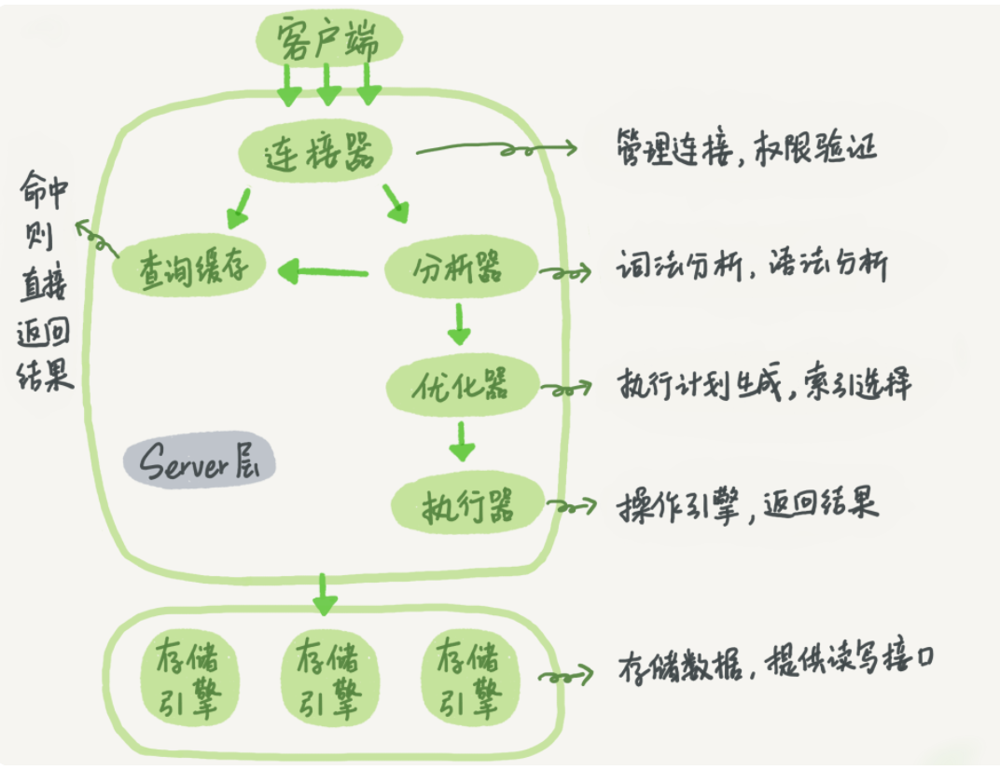

## MYSQL基础知识
### sql在mysql中执行流程
sql语句->连接器->查询缓存(mysql8.0已删除)->解析器->优化器->执行器

</img>

### 隔离级别下出现问题
- 脏读 A事务读到B事务修正但是还没有commit的数据,读未提交的数据,称为脏读
- 不可重复读 对某数据进行读取,两次读取的结果不同,这因为其他事务对改数据进行了修改或删除
- 幻读(专指插入数据) 在事务中,前后两次查询到符合条件数据总数不一致,其他事务插入数据

## MYSQL语句
```php
    //连接mysql(连接建立以后,权限就确定下来。如果发生变化,需要下次重新连接时生效)
    mysql -h$ip -P$port -u$user -p
    //查询语句显示使用查询缓存(query_cache_type=DEMAND(所有查询不适用缓存))
    select SQL_CACHE * from T where ID = 100
    //创建删除DB
    CREATE DATABASE test
    DROP DATABASE test
    //创建表
    DROP TABLE IF EXISTS test;
    CREATE TABLE test (
        //字段 数据类型
        id int(11) NOT NULL AUTO_INCREMENT,
        uid int(11) NOT NULL DEFAULT '0' COMMENT '',
        //索引
        PRIMARY KEY (id) USING BTREE,
        UNIQUE INDEX idx_uid(uid) USING BTREE //唯一索引
        KEY idx_uid(uid) //普通索引
    ) ENGINE=InnoDB AUTO_INCREMENT=0 DEFAULT CHARSET=utf8 COMMENT='';
    //) ENGINE=InnoDB CHARACTER SET = utf8 COLLATE = utf8_general_ci ROW_FORMAT = Dynamic;
    //查
    SELECT ... FROM ... WHERE ... GROUP BY ... HAVING ... ORDER BY ... LIMIT ...
        //某课程讲解select执行顺序
        /*
            SELECT DISTINCT player_id, player_name, count(*) as num #顺序5
            FROM player JOIN team ON player.team_id = team.team_id #顺序1
            WHERE height > 1.80 #顺序2
            GROUP BY player.team_id #顺序3
            HAVING num > 2 #顺序4
            ORDER BY num DESC #顺序6
            LIMIT 2 #顺序7

            完整的SELECT语句内部执行顺序是：
            1、FROM子句组装数据（包括通过ON进行连接）
            2、WHERE子句进行条件筛选
            3、GROUP BY分组
            4、使用聚集函数进行计算；
            5、HAVING筛选分组；
            6、计算所有的表达式；
            7、SELECT 的字段；
            8、ORDER BY排序
            9、LIMIT筛选
        */
    //改
    UPDATE T set age = 1 WHERE id = 1
    //字段修正
    ALTER TABLE test ADD age int(11) unsigned; //添加字段
    ALTER TABLE test CHANGE old_uid new_id int(11) NOT NULL; //修改字段名
    ALTER TABLE test MODIFY COLUMN uid bigint(20) NOT NULL; //修改字段类型
    ALTER TABLE test DROP COLUMN uid; //删除字段
    //索引
    ALTER TABLE test ADD PRIMARY_KEY (column)
        | UNIQUE (column)
        | INDEX index_name (column)
        | FUllTEXT (column)
        | INDEX index_name (column, column ...)
    CREATE INDEX|UNIQUE... index_name ON test(column)
    //删除索引
    ALTER TABLE test DROP index index_name
    ALTER TABLE test DROP primary key
    DROP index index_name on test
    //视图
    CREATE VIEW view_name AS SELECT column1, column2 FROM table WHERE condition
    ALTER VIEW view_name AS SELECT column1, column2 FROM table WHERE condition //修改视图
    DROP TABLE view_name
    //存储过程
    CREATE PROCEDURE 存储过程名称([参数列表])
    BEGIN
        需要执行的语句
    END
        /*
        //例子
        DELIMITER //
        CREATE PROCEDURE `add_num`(IN n INT)
        BEGIN
               DECLARE i INT;
               DECLARE sum INT;

               SET i = 1;
               SET sum = 0;
               WHILE i <= n DO
                      SET sum = sum + i;
                      SET i = i +1;
               END WHILE;
               SELECT sum;
        END //
        DELIMITER ;
        */
    //删除存储过程
    DROP TABLE view_name 

    DDL: CREATE DROP ALTER //修改表结构
    DML: SELECT DELETE UPDATE INSERT //增删改查
```
## MYSQL日志
- WAL技术(Write-Ahead Logging)
    + 先写日志(redo log) 在写磁盘
    + InnoDB引擎先把记录写到redo log(也在磁盘上,顺序IO),并更新内存(更新内存的意思是先要把这一行记录从磁盘加载到内存中(buffer_pool),然后在内存中更新这个值。不会立即把最新值刷新到磁盘),InnoDB在适当的时候刷新到磁盘
        * 流程: InnoDB记录到redo log(顺序Io磁盘)->更新内存->刷新到磁盘(随机IO)
- redo log(重做日志:InnoDB引擎独有,顺序IO,并且可以组提交),有固定大小,如果写满了需要擦除最开始的记录,有了 redo log,InnoDB 就可以保证即使数据库发生异常重启,之前提交的记录都不会丢失,这个能力称为 crash-safe
- undo log(回滚日志)
- binlog(归档日志,server层)
    + binlog格式：statement格式记录sql语句。row格式记录行的内容,记录两条,更新前和更新后


TIP: SQL在更新的时候, 除了记录变更记录,还会记录一条变更相反的回滚操作记录,前者记录在redo log,后者记录在undo log

## MYSQL常用语法
```php
show profile;获取上一次请求的执行时间(解析模块、优化模块等各个时间)(select @@profiling; set profiling=1)
    show profile for query 2(查询id query_ 指定查询id
id)
```

TIP: 临时表只在当前连接存在,关闭连接后,临时表就会自动释放

## MYSQL优化
### 数据库优化整体思路
    1 优化表设计(字段类型选择、冗余字段)
    2 优化逻辑查询(sql语句、子查询优化等)
    3 物理优化(加索引)
    4 使用redis缓存组件减少DB压力
    5 库级优化(主从、分库分表)

## MYSQL开发中注意问题

### 索引
- 聚集索引(主键索引)
- 非聚集索引(普通索引、唯一索引、唯一索引)
    + 联合索引时,范围条件查询,比如<、<=、>、>=、between等。那么范围列后的列就无法使用到索引

### 总结问题
- mysql长连接导致占用内存增长过快(mysql异常重启原因)   
    + 因为mysql在执行过程中临时使用内存是管理在连接对象里面,这些只有连接断开时才会释放,所以如果长连接累积下来,可能导致内存占用太大,被系统强行杀掉（OOM）,从现象看就是 MySQL 异常重启了
    + 解决方案 1定期断开长连接。使用一段时间,或者程序里面判断执行过一个占用内存的大查询后,断开连接,之后要查询再重连。2 如果你用的是 MySQL 5.7或更新版本,可以在每次执行一个比较大的操作后,通过执行 mysql_reset_connection 来重新初始化连接资源。这个过程不需要重连和重新做权限验证,但是会将连接恢复到刚刚创建完时的状态
- 


