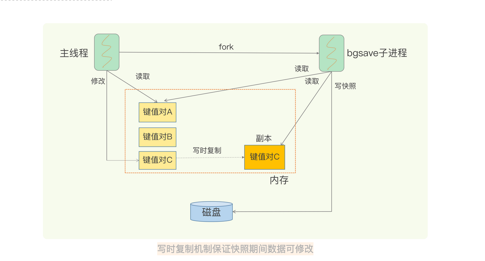
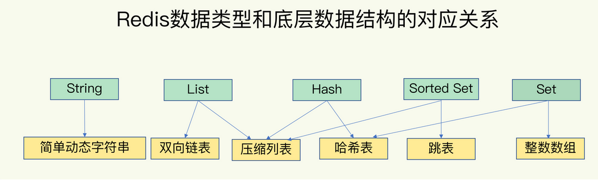
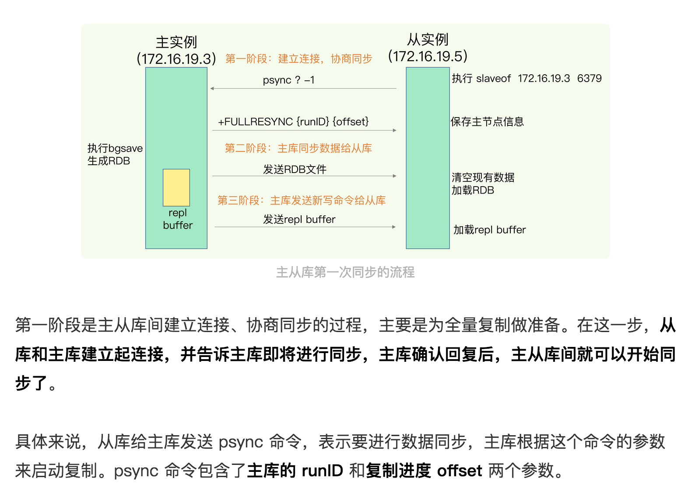
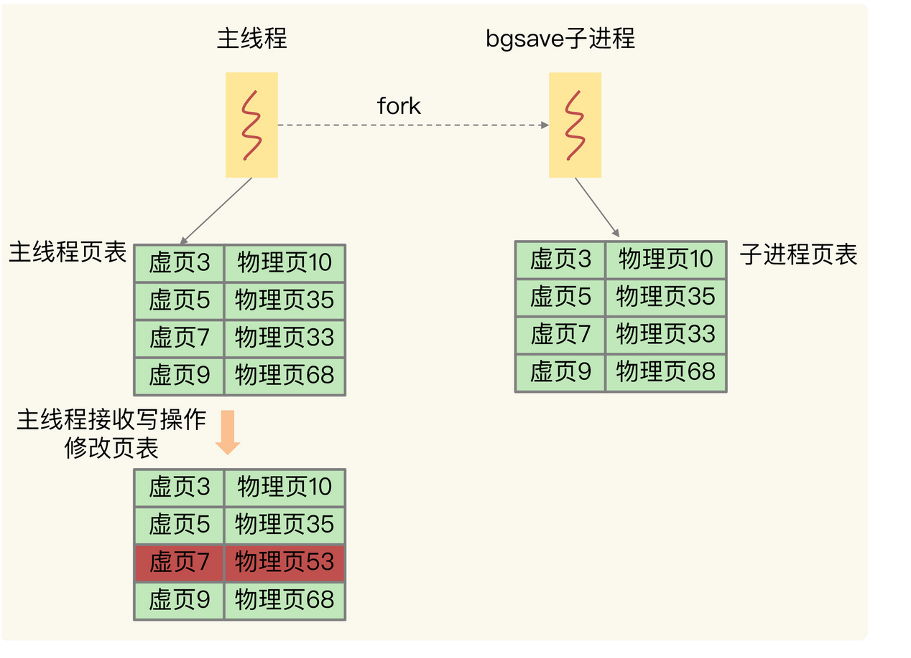
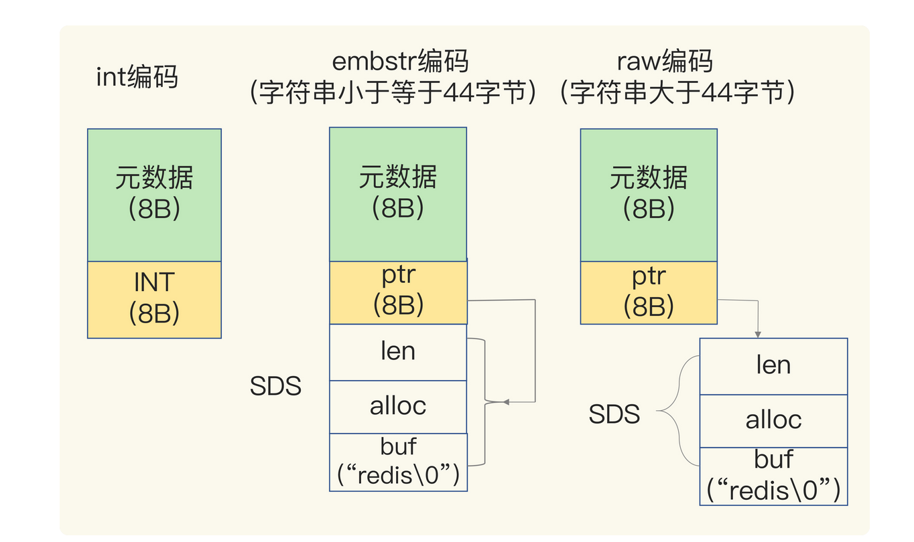

## redis重点知识
#### Redis命令&配置
- config修改配置后,持久化到文件中的命令: config rewrite

#### Redis类型特点
- HASH
    + 不支持对数据的范围查询
- SORTED SET
    + 支持范围查询,不支持聚合操作
- LIST
    + 不支持多个消费者消费一个队列
### Redis持久化(AOF和RDB)
#### AOF(记录的是操作命令(主线程复制AOF))
- 持久化机制(先写内存,后写日志(写日志顺序写,写磁盘随机写))
    1. AOF写日志时不进行语法检查(若先写log,则会造成log记录了错误的语法)
    2. 日志只记录成功的命令
    3. 执行完再记录不会阻塞当前写操作(把日志写到磁盘时,如果磁盘压力很大会写盘很慢)
    4. AOF写日志时,是在主线程完成
- AOF写回策略(写日志策略、如何控制AOF日志写回的时机?appendfsync的配置项如下)
    1. Always,同步写回：每个写命令执行完，立马同步地将日志写回磁盘
    2. Everysec，每秒写回：每个写命令执行完，只是先把日志写到 AOF 文件的内存缓冲区，每隔一秒把缓冲区中的内容写入磁盘
    3. No，操作系统控制的写回：每个写命令执行完，只是先把日志写到 AOF 文件的内存缓冲区，由操作系统决定何时将缓冲区内容写回磁盘
- AOF过大问题与处理
    1. 文件系统本身对文件大小有限制。 文件太大,再追加命令记录,效率会变低。如果发生宕机，AOF 中记录的命令要一个个被重新执行，用于故障恢复，如果日志文件太大，整个恢复过程就会非常缓慢，这就会影响到 Redis 的正常使用
    2. AOF重写机制(**由后台子进程bgrewriteaof来完成**),对过大的AOF文件进行重写，以此来压缩AOF文件的大小。 具体的实现是：检查当前键值数据库中的键值对，记录键值对的最终状态，从而实现对 某个键值对 重复操作后产生的多条操作记录压缩成一条 的效果。进而实现压缩AOF文件的大小
        1. fork子进程时，子进程是会拷贝父进程的页表，即虚实映射关系，而不会拷贝物理内存。子进程复制了父进程页表，也能共享访问父进程的内存数据了，此时，类似于有了父进程的所有内存数据
    3. 触发AOF重写 同时超出auto-aof-rewrite-min-size和auto-aof-rewrite-percentage或手动执行BGREWRITEAOF
#### RDB(二进制数据)
- RDB生成快照(save和bgsave)
    1. save：在主线程中执行，会导致阻塞。bgsave：创建一个子进程，专门用于写入 RDB 文件，避免了主线程的阻塞，这也是 Redis RDB 文件生成的默认配置
- RDB快照时数据是否能修改
    1. Redis 就会借助操作系统提供的写时复制技术（Copy-On-Write, COW），在执行快照的同时，正常处理写操作
        1. redis 生成rdb 时候会fork 子进程。此时的读写操作： 读：主线程和bgsave子进程互不影响。 写：被修改的数据会被复制一份为副本，bgsave 把副本数据写入rdb 文件，主线程修改原数据
        2. “这块数据就会被复制一份，生成该数据的副本”，这个操作在实际执行过程中，是子进程复制了主线程的页表，所以通过页表映射，能读到主线程的原始数据，而当有新数据写入或数据修改时，主线程会把新数据或修改后的数据写到一个新的物理内存地址上，并修改主线程自己的页表映射。所以，子进程读到的类似于原始数据的一个副本，而主线程也可以正常进行修改

- 多久一次RDB快照
    1. 频繁将全量数据写入磁盘，会给磁盘带来很大压力，多个快照竞争有限的磁盘带宽，前一个快照还没有做完，后一个又开始做了，容易造成恶性循环
    2. bgsave 子进程需要通过 fork 操作从主线程创建出来。虽然，子进程在创建后不会再阻塞主线程，但是，fork 这个创建过程本身会阻塞主线程，而且主线程的内存越大，阻塞时间越长。如果频繁 fork 出 bgsave 子进程，这就会频繁阻塞主线程了
    3. 增量快照
    4 混合使用RDB和AOF,在两次快照直接,利用AOF记录日志记录,等到第二次做全量快照时，就可以清空 AOF 日志，因为此时的修改都已经记录到快照中了，恢复时就不再用日志了

#### AOF 和 RDB 的选择问题
- 数据不能丢失时，内存快照和 AOF 的混合使用是一个很好的选择
- 如果允许分钟级别的数据丢失，可以只使用 RDB
- 如果只用 AOF，优先使用 everysec 的配置选项，因为它在可靠性和性能之间取了一个平衡

#### Redis支持类型和底层数据结构关系
  

#### Redis和DB数据一致性问题
- 主从库实现数据一致(主读写,从读)
    1. B是从库,A主库, replicaof/slaveof(Redis 5.0以前) A库IP 6379
    2. AB连接以后同步流程
    3. 从库太多,导致主库压力增大,可以主从从模式同步数据

- 主从断连
    1. 主库会把断连期间收到的写操作命令，写入 replication buffer，同时也会把这些操作命令也写入 repl_backlog_buffer 这个缓冲区
- 哨兵机制
    1. 哨兵的本质：是一个redis实例，要做三件事：监控主库，选举新主库，通知客户端和从机
    2. 哨兵是通过心跳检测，监控主库状态，主库下线被分为：主观下线和客观下线、
    3. 哨兵监控是可能误判的，所以哨兵一般是集群部署，采取投票的形式减少误判
    4. 选定新主库规则是先筛选在打分，得分高的会被选为新主库
    5. 打分筛选规则: 从库的优先级(优先级最高的从库得分高)，数据同步状况(和旧主库同步程度最接近的从库得分高)，Id号大小
    6. 哨兵的使用
        1. 主库下线，可读不可写，写失败的时间=哨兵切换主从的时间+客户端感知新主库时间
        2. 哨兵主动通知：哨兵需要将最新的主库地址写入自己的pubsub中，客户端需要订阅这个pubsub，当这个pubsub有数据时，客户端就能感知到
        3. 户端主动获取：客户端不将主从库写死，而是从哨兵集群中获取，从而始终获取最新的主从地址
        4. 集群分片模式的Redis集群，可以不使用哨兵机制
- 哨兵集群的工作机制
    1. 哨兵之间互通机制：基于pub/sub机制，在主库中有一个"__sentinel__:hello"的频道，哨兵之间互相发现通信
    2. 哨兵与主从库互通机制：哨兵向主库发送INFO指令，可以获取所有从库的信息，实现对主库，从库的监控
    3. 哨兵判定主库异常机制：哨兵集群中任意一个实例都可以发起主库异常“投票仲裁”流程
- 切片集群-Redis Cluster实现
    1. 数据和实例建立联系,RedisCluster通过hash Slot(哈希槽) 去hash某个键值对,CRC16(key) % 16384
    2. 一个切片集群有16384个槽,这些槽被RedisCluster平均分配给集群中所有实例,也可以手动分配,但是手动分配时,16384个槽必须要全部分配完
    3. 在集群中,每个实例都会保存其他实例的hash slot,这样客户端请求到那个实例,都可以通过crc16公式计算出ahsh slot,然后找到对应的实例

#### 写时复制的底层机制
bgsave 子进程复制主线程的页表以后，假如主线程需要修改虚页 7 里的数据，那么，主线程就需要新分配一个物理页（假设是物理页 53），然后把修改后的虚页 7 里的数据写到物理页 53 上，而虚页 7 里原来的数据仍然保存在物理页 33 上。这个时候，虚页 7 到物理页 33 的映射关系，仍然保留在 bgsave 子进程中。所以，bgsave 子进程可以无误地把虚页 7 的原始数据写入 RDB 文件


#### Redis的String类型益处与问题
- String保存数据时所消耗内存多
    + RedisObject当保存的是 Long 类型整数时，RedisObject 中的指针就直接赋值为整数数据了，这样就不用额外的指针再指向整数了，节省了指针的空间开销
    + RedisObject当保存的是字符串数据，并且字符串小于等于 44 字节时，RedisObject 中的元数据、指针和 SDS 是一块连续的内存区域，这样就可以避免内存碎片。这种布局方式也被称为 embstr 编码方式
    + RedisObject当字符串大于 44 字节时，SDS 的数据量就开始变多了，Redis 就不再把 SDS 和 RedisObject 布局在一起了，而是会给 SDS 分配独立的空间，并用指针指向 SDS 结构。这种布局方式被称为 raw 编码模式
    + string保存数据利用一个RedisObject(包含8字节元数据(比如最后一次访问的时间、被引用的次数等)和8字节指针(如过是整型则是值,不是指针))对象,指针指向SDS字符
    + SDS同时也包含一些公共数据
        * buf：字节数组，保存实际数据。为了表示字节数组的结束，Redis 会自动在数组最后加一个“\0”，这就会额外占用 1 个字节的开销
        * len：占 4 个字节，表示 buf 的已用长度
        * alloc：也占个 4 字节，表示 buf 的实际分配长度，一般大于 len
    + String类型除了这些，Redis还会使用一个全局哈希表保存所有键值对,哈希表的每一项是一个 dictEntry 的结构体，用来指向一个键值对。dictEntry 结构中有三个 8 字节的指针，分别指向 key、value 以及下一个 dictEntry，三个指针共 24 字节


#### Redis的Hash类型益处与问题
- Hash类型底层结构压缩列表和哈希表(hash类型底层默认使用压缩列表)
    + 往 Hash 集合中写入的元素个数超过了 hash-max-ziplist-entries，或者写入的单个元素大小超过了 hash-max-ziplist-value，Redis 就会自动把 Hash 类型的实现结构由压缩列表转为哈希表,一旦从压缩列表转为了哈希表，Hash 类型就会一直用哈希表进行保存，而不会再转回压缩列表了。在节省内存空间方面，哈希表就没有压缩列表那么高效了
        * hash-max-ziplist-entries：表示用压缩列表保存时哈希集合中的最大元素个数
        * hash-max-ziplist-value：表示用压缩列表保存时哈希集合中单个元素的最大长度

#### Redis并发访问
**原子操作** : 利用Redis中原子单命令操作(INCR/DECR/SET等),或者把多个操作写到LUA脚本中执行

**加锁** : 加锁操作setnx或者set+lua(释放锁时)**加锁导致并发降低且加锁业务逻辑复杂**

#### Redis事务注意事项(MULTI、EXEC)
- 命令入队时就报错(例如redis中没有的命令PUT)
    1. 在这种情况下，事务本身就会被放弃执行,这种情况事务会回滚
- 命令入队时没报错，实际执行时报错(LPOP操作字符串类型)
    1. 有错误的命令不会被执行，正确的命令可以正常执行
- EXEC 命令执行时实例发生故障
    1. 如果开启了 AOF 日志，可以保证原子性。如果没有开启RDB和AOF也可以保障原子性

#### Redis数据不一致
- 主从数据不一致
    1. 主从同步传输延迟, 即使从库及时收到了主库的命令,但是从库如果在执行其他复杂的逻辑(例如集合操作命令)而阻塞
  
    **解决方法** : 要尽量保证主从库间的网络连接状况良好。例如，我们要避免把
    主从库部署在不同的机房，或者是避免把网络通信密集的应用（例如数据分析应用）和 Redis
     主从库部署在一起
- Redis集群中读到过期数据(删除数据只在主库,从库不会执行删除)
    1. Redis 的过期数据删除策略造成,Redis 同时使用了两种策略来删除过期的数据，分别是惰性删除策略和定期删除策略
        惰性删除策略: 数据过期后不会立即删除,等再次读取这个数据时才会删除
        定期删除策略: Redis每隔一段时间(默认100ms),随机选择一些数据检查是否过期
        注意:  Redis 3.2 之前的版本，那么，从库在服务读请求时，并不会判断数据是否过期，而是会返回过期数据。在 3.2 版本后，Redis 做了改进，如果读取的数据已经过期了，从库虽然不会删除，但是会返回空值，这就避免了客户端读到过期数据。所以，在应用主从集群时，尽量使用 Redis 3.2 及以上版本。

    **解决方法** : 使用 Redis 3.2 及以上版本。使用 EXPIREAT/PEXPIREAT 命令设置过期时间，避免从库上的数据过期时间滞后

#### Redis缓存淘汰策略
- 不进行数据淘汰的策略，只有 noeviction 这一种(默认策略)
- 会进行淘汰的 7 种其他策略
    + 在设置了过期时间的数据中进行淘汰，包括 volatile-random、volatile-ttl、volatile-lru、volatile-lfu（Redis 4.0 后新增）四种(内存使用量达到了 maxmemory 阈值、键值对的过期时间是快到了都会被四中策略执行)
        * volatile-ttl 在筛选时，会针对设置了过期时间的键值对，根据过期时间的先后进行删除，越早过期的越先被删除
        * volatile-random 就像它的名称一样，在设置了过期时间的键值对中，进行随机删除
        * volatile-lru 会使用 LRU 算法筛选设置了过期时间的键值对
        * volatile-lfu 会使用 LFU 算法选择设置了过期时间的键值对
    + 在所有数据范围内进行淘汰，包括 allkeys-lru、allkeys-random、allkeys-lfu（Redis 4.0 后新增）三种（如果一个键值对被删除策略选中了，即使它的过期时间还没到，也需要被删除。当然，如果它的过期时间到了但未被策略选中，同样也会被删除）
        * allkeys-random 策略，从所有键值对中随机选择并删除数据
        * allkeys-lru 策略，使用 LRU 算法在所有数据中进行筛选
        * allkeys-lfu 策略，使用 LFU 算法在所有数据中进行筛选
    + LRU策略(链表管理所有的缓存数据带来额外的空间开销),最近最少访问的会被删除,Redis 中，LRU 算法被做了简化，以减轻数据淘汰对缓存性能的影响.具体来说，Redis 默认会记录每个数据的最近一次访问的时间戳（由键值对数据结构 RedisObject 中的 lru 字段记录）。然后，Redis 在决定淘汰的数据时，第一次会随机选出 N 个数据，把它们作为一个候选集合。接下来，Redis 会比较这 N(** CONFIG SET maxmemory-samples 100配置N的个数 **) 个数据的 lru 字段，把 lru 字段值最小的数据从缓存中淘汰出去(注意这里：是随机选出N个数据，然后找最小的，这就相当于将获取全局最优解退化成获取局部最优解，但这样不用维护链表，提高了性能)。当需要再次淘汰数据时，Redis 需要挑选数据进入第一次淘汰时创建的候选集合。这儿的挑选标准是：能进入候选集合的数据的 lru 字段值必须小于候选集合中最小的 lru 值。当有新数据进入候选数据集后，如果候选数据集中的数据个数达到了 maxmemory-samples，Redis 就把候选数据集中 lru 字段值最小的数据淘汰出去。这样一来，Redis 缓存不用为所有的数据维护一个大链表，也不用在每次数据访问时都移动链表项，提升了缓存的性
    + 淘汰策略建议
        * 优先使用 allkeys-lru 策略。这样，可以充分利用 LRU 这一经典缓存算法的优势，把最近最常访问的数据留在缓存中，提升应用的访问性能。如果你的业务数据中有明显的冷热数据区分，我建议你使用 allkeys-lru 策略
        * 如果业务应用中的数据访问频率相差不大，没有明显的冷热数据区分，建议使用 allkeys-random 策略，随机选择淘汰的数据就行
        * 如果你的业务中有置顶的需求，比如置顶新闻、置顶视频，那么，可以使用 volatile-lru 策略，同时不给这些置顶数据设置过期时间。这样一来，这些需要置顶的数据一直不会被删除，而其他数据会在过期时根据 LRU 规则进行筛选

#### Redis旁路缓存(缓存)
- 只读缓存(加速读请求),只读缓存没有更新,仅有读取和删除,在更新时直接更新DB,然后删除Redis,在读取时,若Redis没有数据,则从DB取数据,然后插入到Redis中
- 读写缓存(加速读写请求),增删改查直接在Redis中操作(Redis有丢失最新数据风险,故有写会DB策略(同步写会和异步写会))
    + 同步写会策略(会降低Redis性能,但是保证了数据可靠性,高并发下数据库和缓存的不一致,需要分布式锁)
        * 保障Redis和DB数据一致性,需要分布式锁或事务机制或LUA等策略
    + 异步写会策略(直接在Redis中操作,直接返回响应,数据有丢失风险)

#### 保证缓存和后端数据库的一致性问题
- Cache Aside策略(只读缓存),读操作命中缓存直接返回，否则从后端数据库加载到缓存再返回。写操作直接更新数据库，然后删除缓存。这种策略的优点是一切以后端数据库为准，可以保证缓存和数据库的一致性。缺点是写操作会让缓存失效，再次读取时需要从数据库中加载。这种策略是我们在开发软件时最常用的，在使用Memcached或Redis时一般都采用这种方案
- Read/Write Throught策略,应用层读写只需要操作缓存，不需要关心后端数据库.应用层在操作缓存时，缓存层会自动从数据库中加载或写回到数据库中，这种策略的优点是，对于应用层的使用非常友好，只需要操作缓存即可，缺点是需要缓存层支持和后端数据库的联动
- Write Back策略,类似于文章所讲的读写缓存模式+异步写回策略.写操作只写缓存，比较简单。而读操作如果命中缓存则直接返回，否则需要从数据库中加载到缓存中，在加载之前，如果缓存已满，则先把需要淘汰的缓存数据写回到后端数据库中，再把对应的数据放入到缓存中。这种策略的优点是，写操作飞快（只写缓存），缺点是如果数据还未来得及写入后端数据库，系统发生异常会导致缓存和数据库的不一致。这种策略经常使用在操作系统Page Cache中，或者应对大量写操作的数据库引擎中
- 解决缓存和DB数据一致性问题
    + 重试机制
        * 把要删除的缓存或者是要更新的数据库值暂存到队列中(例如RabbitMq),当应用没有成功删除缓存或者是修改成功数据库值时,可以从队列中重新读值,再次删除或更新，如果能够成功地删除或更新，我们就要把这些值从消息队列中去除，以免重复操作

#### 缓存击穿、穿透、雪崩
**缓存击穿**: 请求热点key时,无法在缓存中处理(或者热点key过期瞬间,大量请求),导致请求打到DB上
- 原因1: Redis中热点key瞬间失效
    1. **热点key不设置过期时间**
    2. **互斥锁** : 现象是多个线程同时去查询数据库的这条数据，那么我们可以在第一个查询数据的请求上使用一个互斥锁来锁住它。其他的线程走到这一步拿不到锁就等着，等第一个线程查询到了数据，然后做缓存。后面的线程进来发现已经有缓存了，就直接走缓存
    
**缓存穿透**: 指要访问的数据既不在 Redis 缓存中，也不在数据库中
- 原因1: 业务层误操作,缓存中的数据和数据库中的数据被误删除了
- 原因2: 恶意攻击,专门访问数据库中没有的数据
    1. 缓存空值或缺省值
    2. 使用布隆过滤器快速判断数据是否存在，避免从数据库中查询数据是否存在，减轻数据库压力（判断数据不在布隆过滤器中，一定不在数据库中，直接返回。判断在布隆过滤器中，可能误判，不一定在数据库中，若不在数据库中仍然发生缓存穿透，然后缓存空值或缺省值。）

**缓存雪崩**: 指大量的应用请求在无法在Redis中处理,紧接着请求打到DB上,导致DB压力激增
- 原因1: Redis中大量key同时过期
    1. **避免key同时失效** : 如果业务上确实要求有些数据同时失效,则可以用Expire给每个数据设置过期时间时额外增加一个随机值(例如增加1-3分钟)
    2. **服务降级(针对不同数据采取不同处理方式)** : 当业务访问非核心数据(例如电商商品属性),则可以暂停从Redis中查询,直接返回预定义信息、空值、错误信息等(根据具体业务环境返回),若是核心业务时,则仍然可以访问Redis和DB
    3. **数据预热** : 缓存预热就是系统上线后，将相关的缓存数据直接加载到缓存系统。这样就可以避免在用户请求的时候，先查询数据库，然后再将数据缓存的问题。用户直接查询事先被预热的缓存数据。可以通过缓存reload机制，预先去更新缓存，在即将发生大并发访问前手动触发加载缓存不同的key**定时更新缓存策略双层缓存策略** : 实效性要求不高的缓存，容器启动初始化加载，采用定时任务更新或移除缓存
    4. **双层缓存策略** : C1为原始缓存，C2为拷贝缓存，C1失效时，可以访问C2，C1缓存失效时间设置为短期，C2设置为长期
    5. **加锁排队** : mutex互斥锁解决，Redis的SETNX去set一个mutex key，当操作返回成功时，再进行加载数据库的操作并回设缓存，否则，就重试整个get缓存的方法
    6. **设置不同的过期时间，让缓存失效的时间点尽量均匀** 
- 原因2: Redis宕机
    1. **服务熔断** : 业务应用调用缓存接口时，缓存客户端并不把请求发给 Redis 缓存实例，而是直接返回，等到 Redis 缓存实例重新恢复服务后，再允许应用请求发送到缓存系统
    2. **请求限流** : 业务系统的请求入口前端控制每秒进入系统的请求数，避免过多的请求被发送到数据库
    3. **Redis高可用** : redis配置主从、哨兵、集群等
    
#### 单线程 Redis 为什么那么快？
- Redis大部分操作在内存完成
- 采用高效的数据结构,例如哈希表和跳表
- 多路复用机制使其在网络 IO 操作中能并发处理大量的客户端请求，实现高吞吐

#### Redis 实例有哪些阻塞点
- 客户端：网络 IO，键值对增删改查操作，数据库操作
    + 复杂度高的增删改查操作肯定会阻塞 Redis(例如集合元素全量查询操作 HGETALL、SMEMBERS，以及集合的聚合统计操作，例如求交、并和差集。这些操作可以作为 Redis 的第一个阻塞点：集合全量查询和聚合操作)
    + 集合自身的删除操作同样也有潜在的阻塞风险(删除操作的本质是要释放键值对占用的内存空间。你可不要小瞧内存的释放过程。释放内存只是第一步，为了更加高效地管理内存空间，在应用程序释放内存时，操作系统需要把释放掉的内存块插入一个空闲内存块的链表，以便后续进行管理和再分配。这个过程本身需要一定时间，而且会阻塞当前释放内存的应用程序，所以，如果一下子释放了大量内存，空闲内存块链表操作时间就会增加，相应地就会造成 Redis 主线程的阻塞(删除bigkey))
    + 网络 IO 有时候会比较慢，但是 Redis 使用了 IO 多路复用机制，避免了主线程一直处在等待网络连接或请求到来的状态，所以，网络 IO 不是导致 Redis 阻塞的因素
    + 清空数据库
- 磁盘：生成 RDB 快照，记录 AOF 日志，AOF 日志重写
    + AOF 日志同步
- 主从节点：主库生成、传输 RDB 文件，从库接收 RDB 文件、清空数据库、加载 RDB 文件
    + 加载 RDB 文件
- 切片集群实例：向其他实例传输哈希槽信息，数据迁移
- Redis4.0增加异步删除bigkey(edis 在运行时会创建三个子线程，主线程会通过一个任务队列和三个子线程进行交互。子线程会根据任务的具体类型，来执行相应的异步操作)
- 开启lazy-free后,什么情况下异步释放内存?
    + 当Hash/Set底层采用哈希表存储（非ziplist/int编码存储）时，并且元素数量超过64个
    + 当ZSet底层采用跳表存储（非ziplist编码存储）时，并且元素数量超过64个
    + 当List链表节点数量超过64个（注意，不是元素数量，而是链表节点的数量，List的实现是在每个节点包含了若干个元素的数据，这些元素采用ziplist存储）
**也就是说String（不管内存占用多大）、List（少量元素）、Set（int编码存储）、Hash/ZSet（ziplist编码存储）这些情况下的key在释放内存时，依旧在主线程中操作**

#### 如何避免单线程模型阻塞和阻塞单线程模型情况
- 集合全量查询和聚合操作
- bigkey 删除
- 清空数据库
- AOF 日志同步写
- 从库加载 RDB 文件

#### Redis变慢或者延迟如何判定？
- 如果你观察到的 Redis 运行时延迟是其基线性能的 2 倍及以上，就可以认定 Redis 变慢了
```
./redis-cli --intrinsic-latency 120
Max latency so far: 17 microseconds.
Max latency so far: 44 microseconds.
Max latency so far: 94 microseconds.
Max latency so far: 110 microseconds.
Max latency so far: 119 microseconds.
36481658 total runs (avg latency: 3.2893 microseconds / 3289.32 nanoseconds per run).
Worst run took 36x longer than the average latency.
```
- 应对变慢问题
    + 慢查询命令(SORT、SUNION/SMEMBERS),尽量用其他高效的命令去解决或者可以在客户端完成
    + 过期key操作(默认情况Redis 每 100 毫秒会删除一些过期 key，删除操作是阻塞的（Redis 4.0 后可以用异步线程机制来减少阻塞影响)（Redis核心技术与实战 18讲）
    + 通过 Redis 日志，或者是 latency monitor 工具，查询变慢的请求
    + 文件系统：AOF 模式

#### Redis删除数据后,为什么内存占用率(top查看)还是很高?
- 当数据删除后，Redis 释放的内存空间会由内存分配器管理，并不会立即返回给操作系统。所以，操作系统仍然会记录着给 Redis 分配了大量内存
    + 问题1 Redis释放的内存空间可能并不是连续的，那么，这些不连续的内存空间很有可能处于一种闲置的状态
    + 问题2 虽然有空闲空间，Redis 却无法用来保存数据，不仅会减少 Redis 能够实际保存的数据量，还会降低 Redis 运行机器的成本回报率
- 删除数据后会造成大量内存碎片(内因是操作系统的内存分配机制，外因是 Redis 的负载特征。)
    + 内因：内存分配器的分配策略
        * Redis 可以使用 libc、jemalloc、tcmalloc 多种内存分配器来分配内存，默认使用 jemalloc,jemalloc 的分配策略之一，是按照一系列固定的大小划分内存空间，例如 8 字节、16 字节、32 字节、48 字节，…, 2KB、4KB、8KB 等。当程序申请的内存最接近某个固定值时，jemalloc 会给它分配相应大小的空间,这样的分配方式本身是为了减少分配次数。例如，Redis 申请一个 20 字节的空间保存数据，jemalloc 就会分配 32 字节，此时，如果应用还要写入 10 字节的数据，Redis 就不用再向操作系统申请空间了，因为刚才分配的 32 字节已经够用了，这就避免了一次分配操作.但是，如果 Redis 每次向分配器申请的内存空间大小不一样，这种分配方式就会有形成碎片的风险，而这正好来源于 Redis 的外因了
    + 外因：键值对大小不一样和删改操作
        * Redis 通常作为共用的缓存系统或键值数据库对外提供服务，所以，不同业务应用的数据都可能保存在 Redis 中，这就会带来不同大小的键值对。这样一来，Redis 申请内存空间分配时，本身就会有大小不一的空间需求。这是第一个外因
        * 这些键值对会被修改和删除，这会导致空间的扩容和释放
    + 如何判断是否有内存碎片?
        * INFO memory命令, mem_fragmentation_ratio指标
            - mem_fragmentation_ratio = used_memory_rss/ used_memory,used_memory_rss 是操作系统实际分配给 Redis 的物理内存空间，里面就包含了碎片；而 used_memory 是 Redis 为了保存数据实际申请使用的空间
    + 如何清理内存碎片?
        * 重启 Redis 实例
        * Redis 自身提供了一种内存碎片自动清理的方法(4.0-RC3 版本以后)
            - 碎片清理是有代价的,操作系统需要把多份数据拷贝到新位置，把原有空间释放出来，这会带来时间开销。因为 Redis 是单线程，在数据拷贝时，Redis 只能等着，这就导致 Redis 无法及时处理请求，性能就会降低。而且，有的时候，数据拷贝还需要注意顺序，就像刚刚说的清理内存碎片的例子，操作系统需要先拷贝 D，并释放 D 的空间后，才能拷贝 B。这种对顺序性的要求，会进一步增加 Redis 的等待时间，导致性能降低
            - 尽量缓解这个问题,这就要提到，Redis 专门为自动内存碎片清理功机制设置的参数了。我们可以通过设置参数，来控制碎片清理的开始和结束时机，以及占用的 CPU 比例，从而减少碎片清理对 Redis 本身请求处理的性能影响
                + config set activedefrag yes(启用了自动清理功能)
                + 上面命令仅启动,具体什么时候清理，会受到下面这两个参数的控制
                    * active-defrag-ignore-bytes 100mb：表示内存碎片的字节数达到 100MB 时，开始清理
                    * active-defrag-threshold-lower 10：表示内存碎片空间占操作系统分配给 Redis 的总空间比例达到 10% 时，开始清理
                + 为了尽可能减少碎片清理对 Redis 正常请求处理的影响，自动内存碎片清理功能在执行时，还会监控清理操作占用的 CPU 时间，而且还设置了两个参数，分别用于控制清理操作占用的 CPU 时间比例的上、下限，既保证清理工作能正常进行，又避免了降低 Redis 性能。这两个参数具体如下
                    * active-defrag-cycle-min 25： 表示自动清理过程所用 CPU 时间的比例不低于 25%，保证清理能正常开展
                    * active-defrag-cycle-max 75：表示自动清理过程所用 CPU 时间的比例不高于 75%，一旦超过，就停止清理，从而避免在清理时，大量的内存拷贝阻塞 Redis，导致响应延迟升高
                    
#### 何应对输出缓冲区溢出（客户端缓冲区）？
- 避免 bigkey 操作返回大量数据结果
- 避免在线上环境中持续使用 MONITOR 命令
- 使用 client-output-buffer-limit 设置合理的缓冲区大小上限，或是缓冲区连续写入时间和写入量上限

#### Redis如何启用慢查询日志?
- 使用慢查询日志前，我们需要设置两个参数
    + slowlog-log-slower-than：这个参数表示，慢查询日志对执行时间大于多少微秒的命令进行记录
    + slowlog-max-len：这个参数表示，慢查询日志最多能记录多少条命令记录。慢查询日志的底层实现是一个具有预定大小的先进先出队列，一旦记录的命令数量超过了队列长度，最先记录的命令操作就会被删除。这个值默认是 128。但是，如果慢查询命令较多的话，日志里就存不下了；如果这个值太大了，又会占用一定的内存空间。所以，一般建议设置为 1000 左右，这样既可以多记录些慢查询命令，方便排查，也可以避免内存开销
- SLOWLOG GET查看慢查询日志中记录的命令操作
    + 参数返回数据详细内容
        * 
        ```SLOWLOG GET 1
        1) 1) (integer) 33           //每条日志的唯一ID编号
           2) (integer) 1600990583   //命令执行时的时间戳
           3) (integer) 20906        //命令执行的时长，单位是微秒
           4) 1) "keys"               //具体的执行命令和参数
              2) "abc*"
           5) "127.0.0.1:54793"      //客户端的IP和端口号
           6) ""                     //客户端的名称，此处为空
        ```
- latency monitor 监控工具，这个工具可以用来监控 Redis 运行过程中的峰值延迟情况

#### 如何排查 Redis 的 bigkey？
- Redis 可以在执行 redis-cli 命令时带上–bigkeys 选项，进而对整个数据库中的键值对大小情况进行统计分析
    + 
    ``` ./redis-cli  --bigkeys

    -------- summary -------
    Sampled 32 keys in the keyspace!
    Total key length in bytes is 184 (avg len 5.75)

    //统计每种数据类型中元素个数最多的bigkey
    Biggest   list found 'product1' has 8 items
    Biggest   hash found 'dtemp' has 5 fields
    Biggest string found 'page2' has 28 bytes
    Biggest stream found 'mqstream' has 4 entries
    Biggest    set found 'userid' has 5 members
    Biggest   zset found 'device:temperature' has 6 members

    //统计每种数据类型的总键值个数，占所有键值个数的比例，以及平均大小
    4 lists with 15 items (12.50% of keys, avg size 3.75)
    5 hashs with 14 fields (15.62% of keys, avg size 2.80)
    10 strings with 68 bytes (31.25% of keys, avg size 6.80)
    1 streams with 4 entries (03.12% of keys, avg size 4.00)
    7 sets with 19 members (21.88% of keys, avg size 2.71)
    5 zsets with 17 members (15.62% of keys, avg size 3.40)
    ```
- 不过，在使用–bigkeys 选项时，有一个地方需要注意一下。这个工具是通过扫描数据库来查找 bigkey 的，所以，在执行的过程中，会对 Redis 实例的性能产生影响。如果你在使用主从集群，我建议你在从节点上执行该命令。因为主节点上执行时，会阻塞主节点。如果没有从节点，那么，我给你两个小建议：第一个建议是，在 Redis 实例业务压力的低峰阶段进行扫描查询，以免影响到实例的正常运行；第二个建议是，可以使用 -i 参数控制扫描间隔，避免长时间扫描降低 Redis 实例的性能。例如，我们执行如下命令时，redis-cli 会每扫描 100 次暂停 100 毫秒（0.1 秒）
    + ./redis-cli  --bigkeys -i 0.1
        * 使用 Redis 自带的–bigkeys 选项排查 bigkey，有两个不足的地方：这个方法只能返回每种类型中最大的那个 bigkey，无法得到大小排在前 N 位的 bigkey；对于集合类型来说，这个方法只统计集合元素个数的多少，而不是实际占用的内存量。但是，一个集合中的元素个数多，并不一定占用的内存就多。因为，有可能每个元素占用的内存很小，这样的话，即使元素个数有很多，总内存开销也不大。所以，如果我们想统计每个数据类型中占用内存最多的前 N 个 bigkey，可以自己开发一个程序，来进行统计
        * 基本的开发思路：使用 SCAN 命令对数据库扫描，然后用 TYPE 命令获取返回的每一个 key 的类型。接下来，对于 String 类型，可以直接使用 STRLEN 命令获取字符串的长度，也就是占用的内存空间字节数
        * 集合类型来说，有两种方法可以获得它占用的内存大小,如果你能够预先从业务层知道集合元素的平均大小，那么，可以使用下面的命令获取集合元素的个数，然后乘以集合元素的平均大小，这样就能获得集合占用的内存大小了
            - List 类型：LLEN 命令
            - Hash 类型：HLEN 命令
            - Set 类型：SCARD 命令
            - Sorted Set 类型：ZCARD 命令
            - 如果你不能提前知道写入集合的元素大小，可以使用 MEMORY USAGE 命令（需要 Redis 4.0 及以上版本），查询一个键值对占用的内存空间。例如，执行以下命令，可以获得 key 为 user:info 这个集合类型占用的内存空间大小
                + MEMORY USAGE user:info
                    (integer) 315663239

#### Redis问题汇总
- 为什么主从库间的复制不使用 AOF
    + RDB 文件是二进制文件，无论是要把 RDB 写入磁盘，还是要通过网络传输 RDB，IO 效率都比记录和传输 AOF 的高
    + 在从库端进行恢复时，用 RDB 的恢复效率要高于用 AOF
- MONITOR 命令主要用在调试环境中，不要在线上生产环境中持续使用 MONITOR(monitor容易造成客户端输出缓存区溢出)


